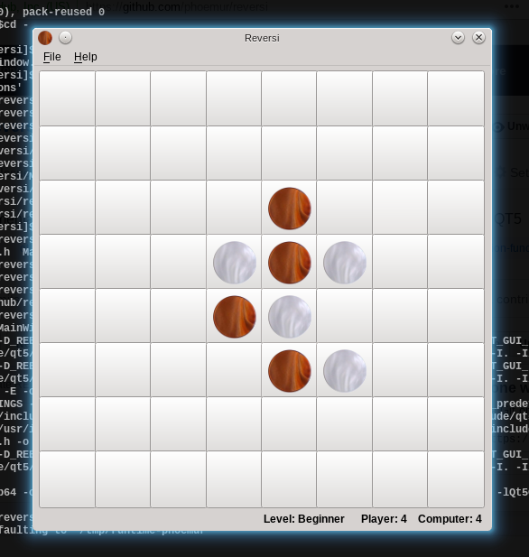

# reversi

This is an implementation of the strategy board game Reversi (a.k.a. Othello tm) in C++14 and QT5.

Reversi is a strategy board game for two players, played on an 8×8 uncheckered board. There are sixty-four identical game pieces called disks (often spelled "discs"), which are light on one side and dark on the other. Players take turns placing disks on the board with their assigned color facing up. During a play, any disks of the opponent's color that are in a straight line and bounded by the disk just placed and another disk of the current player's color are turned over to the current player's color.

The object of the game is to have the majority of disks turned to display your color when the last playable empty square is filled.

Reversi was most recently marketed by Mattel under the trademark Othello.
Source: Wikipedia

Author: Fernando B. Giannasi

# Build and run
    qmake-qt5
    make
    sudo make install
    reversi
    
# About
Despite still inefficient, it beats human players most of the time.
In the beginner level computer chooses randomly the next move from the set of possible moves.
In the intermediate and expert levels it uses an heuristic evaluation function and minimax algorithm with limited depth.

# Screenshot

